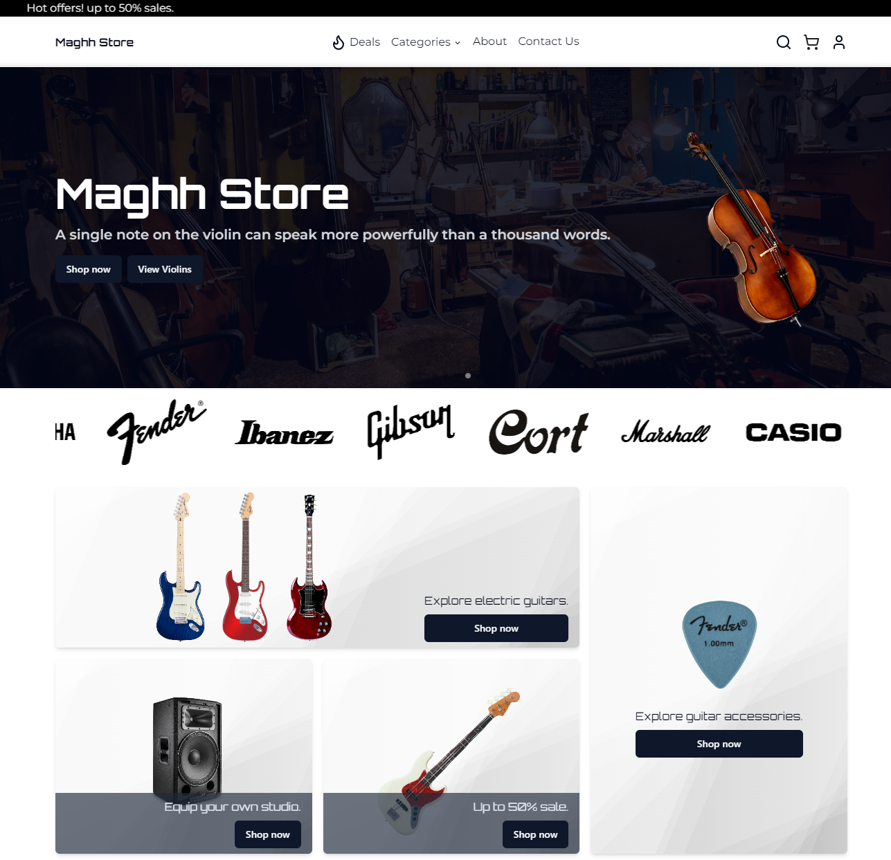
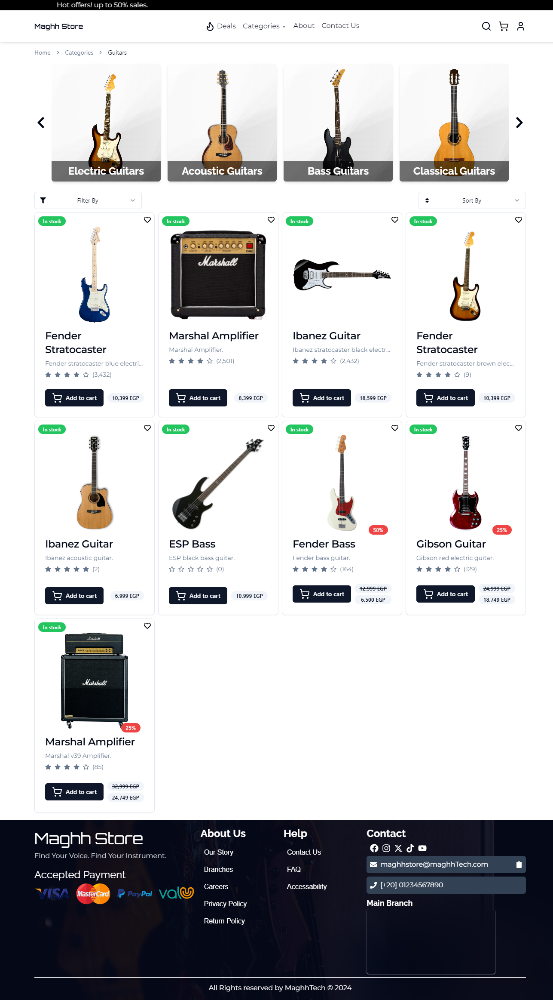
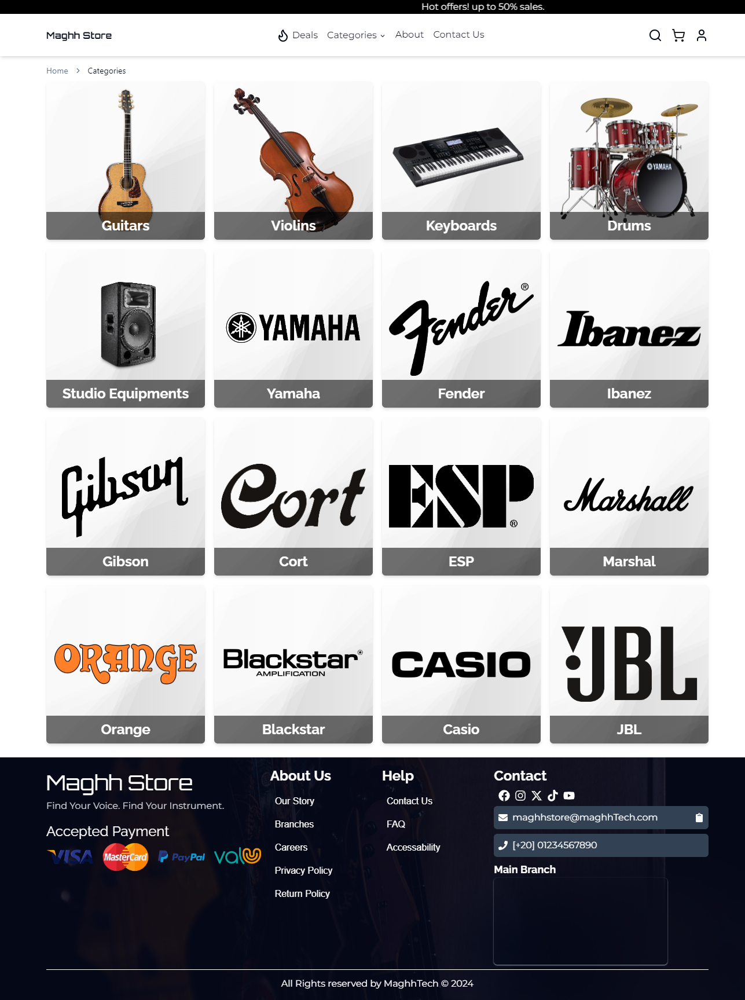
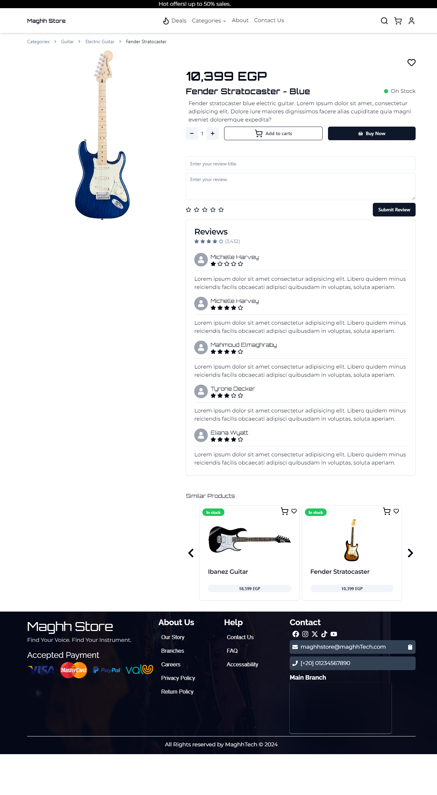
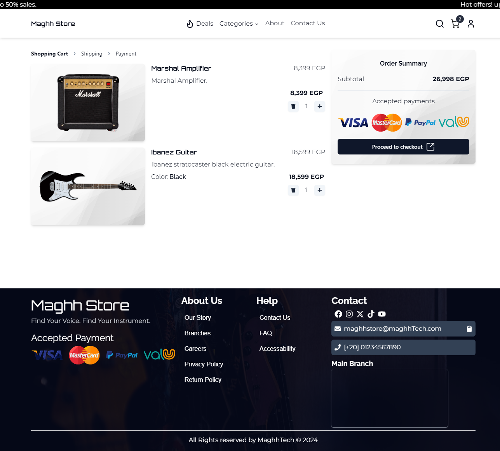
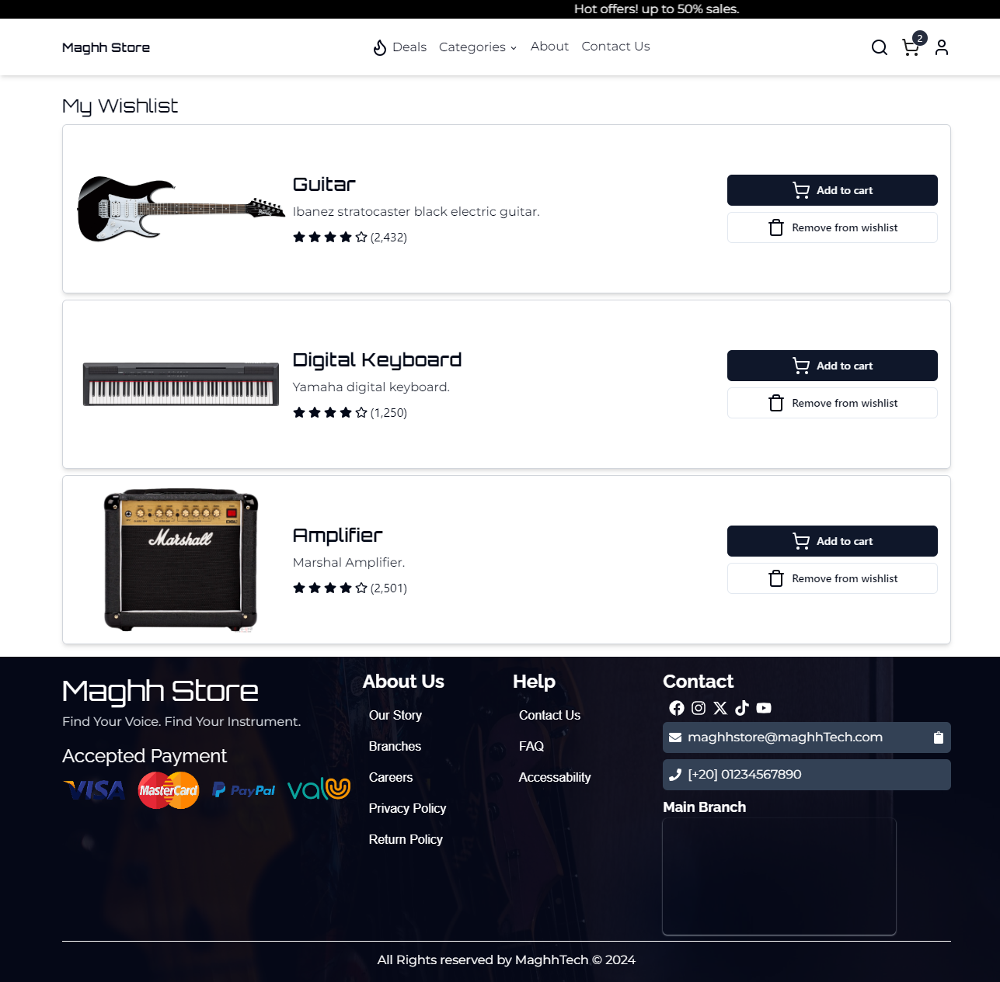

# eCommerce Music Store

**Project Overview**

The eCommerce Music Store is a responsive web platform designed for a music instrument store. It enables users to browse, search, and purchase a wide variety of musical instruments. The application delivers a smooth and dynamic user experience with a modern design, allowing customers to shop from any device. The store supports essential e-commerce functionality, including product catalog navigation, a shopping cart, and a checkout process.
## Features

- **Product Catalog:** Browse a wide selection of musical instruments.
- **Search & Filter:** Find specific instruments with search and filtering options.
- **Shopping Cart:** Add products to the cart and adjust quantities before purchase.
- **Responsive Design:** Optimized for desktop, tablet, and mobile views.
- **State Management:** Redux Toolkit used for centralized state management.
- **Modern UI:** Built using ShadCN UI components for a clean, user-friendly interface.
## Tech Stack

**Client-side**

- ReactJS (VITE): High-performance frontend framework for faster development and optimized performance.
- TypeScript: Strong typing ensures robust and maintainable code.
- TailwindCSS: Utility-first CSS framework for building responsive and custom designs.
- ShadCN UI: Modern UI components for a sleek and minimal interface.
- Redux Toolkit: For efficient and scalable state management.
- React Router: For managing navigation and routing within the app.
## Screenshots









## Demo

Project Demo: https://maghh-store-kohl.vercel.app/
## Installation

1 - Clone the repository:

```bash
  git clone https://github.com/maghrabyy/reactjs-ecommerce.git

```
2 - Navigate to the project directory:

```bash
cd reactjs-ecommerce

```

3 - Install the necessary dependencies:

```bash
npm install

```

4 - Start the development server:

```bash
npm run dev

```
    
## Configuration

The application is built using VITE, which provides faster build times and optimized performance during development.

For state management, Redux Toolkit is configured to manage global application states, such as user authentication, product catalog, and shopping cart data.
## Project Structure

The project follows a clean architecture, with modularized components for easy maintenance and scalability. Here’s an overview of the structure:

- /src
  - **/components:** Reusable UI   components such as product cards, buttons, etc.
  - **/layout:** Layout components for consistent page structure.
  - **/pages:** Different pages like Home, Product Details, Cart, and Checkout.
  - **/store:** Redux store for managing global state.
  - **/util:** Utility functions and helpers used across the app.
## Contributing

Feel free to submit issues or pull requests to help improve this platform. Contributions are always welcome!


## License
This project is licensed under the MIT License.


[MIT](https://choosealicense.com/licenses/mit/)


## 🚀 About Me

Hello! I’m Mahmoud Elmaghraby, a passionate and motivated software developer specializing in frontend development. I have strong proficiency in ReactJS and NextJS, and I am familiar with the complete software development life cycle. I recently graduated from the Information Technology Institute (ITI), where I completed an intensive training program in the Frontend and Cross-Platform Mobile Development track.

I have worked on several projects, including eCommerce platforms and cross-platform mobile applications, and I’m always eager to take on new challenges that help me grow as a developer. Feel free to check out my other repositories or connect with me for collaborations!

- GitHub: [maghrabyy](https://github.com/maghrabyy)
- LinkedIn: [Mahmoud Elmaghraby](https://linkedin.com/in/maghrabyy)
